# DirectX 12 Interactive Cube

Projeto acadêmico em C++20, Win32, Direct3D 12, HLSL e DirectXMath. O cubo interativo é o instrumento visual; o assunto principal é o caminho completo dos dados entre aplicação, CPU, API, driver, GPU, render target, swap chain, Windows e monitor.

O PDF explicativo do projeto está em docs.

## Objetivo

Responder, com código executável: **como mover o mouse acaba alterando pixels físicos no monitor?** O projeto deixa explícitos os objetos do D3D12, as matrizes, os dados da malha, a gravação dos comandos e a sincronização. Não usa engine.

## O que é DirectX

DirectX é uma família de APIs da Microsoft para multimídia no Windows. **Direct3D** é a parte voltada a gráficos 3D e computação na GPU. Direct3D 12 dá à aplicação controle explícito sobre filas, listas de comandos, estados de recursos e sincronização; esse controle reduz trabalho implícito do driver, mas transfere responsabilidades ao programa.

DXGI (DirectX Graphics Infrastructure) enumera adapters e cuida da apresentação por swap chain. HLSL é a linguagem dos shaders executados na GPU.

## O que este projeto demonstra

- janela nativa Win32 e mensagens de input;
- escolha de GPU física compatível, com fallback WARP documentado;
- Device, Command Queue, três Command Allocators e uma Command List reutilizada;
- swap chain flip-discard com três back buffers e VSync;
- descriptor heaps de RTV/DSV e heap shader-visible exclusivo do ImGui;
- vertex/index/constant buffers, Root Signature e PSOs separados;
- cubo com normais planas e iluminação ambient + diffuse + specular;
- superfície Bézier bicúbica com 16 control points e tessellation real da GPU;
- VS, HS, tessellator fixed-function, DS, rasterização e PS;
- painel Dear ImGui interativo, câmera orbital suave e resize completo;
- Fence por frame context, permitindo até três frames em voo;
- D3D12 Debug Layer em Debug e telemetria baseada em valores reais.

O painel usa os backends oficiais Win32 e DirectX 12 do Dear ImGui, fixado na versão `v1.90.9` pelo CMake. Ele é desenhado na mesma Command List, depois da cena, e permite comparar objetos, wireframe, iluminação, specular e tessellation em tempo real. FPS é medido na CPU; adapter, índice do buffer e fence vêm dos objetos reais. Nenhum “tempo de GPU” é inventado.

## Arquitetura geral

```mermaid
flowchart LR
    A[Aplicação C++] -->|Win32/input| C[CPU]
    C -->|chamadas D3D12| API[Direct3D 12 + DXGI]
    API --> D[Driver WDDM]
    D -->|command queue| G[GPU]
    G --> P[Pipeline gráfico]
    P --> RT[Back buffer / Render Target]
    RT --> SC[Swap Chain flip model]
    SC --> W[Windows / DWM]
    W --> DE[Display engine / scanout]
    DE --> L[HDMI ou DisplayPort]
    L --> M[Monitor]
```



O diagrama é conceitual: dependendo de composição, modo de apresentação, otimizações e hardware, o frame pode seguir caminhos sem cópias ou passar por buffers intermediários. `Present` solicita apresentação; não significa que a CPU envia imediatamente pixels por um cabo.

## O que acontece ao iniciar

1. `wWinMain` cria `Application`.
2. `Application` registra uma classe Win32, cria um `HWND` e entra no message loop.
3. `Renderer` tenta habilitar o Debug Layer na build Debug.
4. DXGI enumera adapters por preferência de alto desempenho; adapters de software são ignorados nessa etapa.
5. `D3D12CreateDevice` cria a interface lógica com a GPU selecionada. Se nenhuma GPU servir, WARP é tentado e identificado como software.
6. São criados Command Queue, descriptor heaps e a swap chain de três buffers.
7. Cada frame recebe Command Allocator, Constant Buffer mapeada e Fence Value próprio.
8. Back buffers ganham RTVs; o depth buffer ganha DSV.
9. HLSL é compilado; Root Signature e PSOs de triângulos e patches são criados.
10. Os 24 vértices/36 índices do cubo e os 16 control points Bézier vão para buffers.
11. O ImGui recebe um descriptor heap shader-visible e inicializa backends Win32/DX12.
12. O loop chama `Update()` e `Render()` até a janela fechar.

## Componentes principais

### Adapter e D3D12 Device

O **adapter** DXGI descreve uma implementação gráfica: normalmente uma GPU física e seu driver. O **Device** não é a GPU em si; é a interface lógica usada para criar recursos, filas, PSOs e outros objetos associados àquele adapter.

### Command Queue, Allocator e Command List

- **Command List:** sequência gravada pela CPU (`Clear`, binds, `DrawIndexedInstanced`, barriers).
- **Command Allocator:** memória que sustenta a gravação. Só pode ser resetado quando a GPU terminou os comandos que dependem dele.
- **Command Queue:** recebe listas fechadas na ordem de submissão e alimenta a execução assíncrona na GPU.

O projeto mantém uma lista e três allocators, um por frame context. Isso facilita localizar o ciclo `Reset → gravar → Close → ExecuteCommandLists` em `Renderer::Render`.

### Buffers

O **Vertex Buffer** do cubo contém posição, cor e normal. O **Index Buffer** reúne vértices em triângulos. Outro vertex buffer contém somente os 16 control points do patch Bézier. A **Constant Buffer** de cada frame carrega Model/MVP, câmera, luz, material, flags e fator de tessellation. Seu layout C++/HLSL tem `static_assert` de 192 bytes e a alocação é arredondada para 256 bytes, granularidade exigida para CBVs em D3D12.

Para clareza, vertex e index buffers usam upload heaps. Em uma engine, malhas estáticas normalmente seriam copiadas para default heaps por uma copy command list para obter acesso ideal da GPU. Essa otimização não muda o conceito demonstrado.

### Root Signature e Pipeline State Object

A **Root Signature** é o contrato dos recursos visíveis ao shader; aqui expõe a constant buffer `b0` a todos os estágios necessários. O **PSO** agrupa shaders e estados fixos. O cubo tem PSOs de triângulos sólido/wireframe; a superfície tem PSOs de patch sólido/wireframe, com VS+HS+DS+PS e `D3D12_PRIMITIVE_TOPOLOGY_TYPE_PATCH`.

### Shaders e rasterização

No cubo, o Vertex Shader recebe posição/cor/normal e produz posição projetada, posição de mundo e normal. O Input Assembler lê índices e forma 12 triângulos. Na superfície, VS e Hull Shader preservam os 16 control points, o tessellator gera domínios paramétricos e o Domain Shader avalia posição e normal. Depois, rasterização interpola atributos e o Pixel Shader calcula aparência; o Output Merger aplica depth test e escreve no render target.

## Model, View e Projection

- **Model:** coloca/orienta o objeto no mundo (identidade neste projeto, deliberadamente visível no código).
- **View:** representa a câmera orbital olhando para a origem.
- **Projection:** cria perspectiva com FOV de 45°, near plane 0,1 e far plane 100.

No C++: `MVP = Model * View * Projection`, seguindo vetores-linha do DirectXMath. Os bytes são lidos como matriz column-major no HLSL, onde se usa `mul(MVP, position)`. O comentário ao copiar a constant buffer explica essa equivalência e evita uma transposição dupla.

## Como o cubo é representado

Uma GPU não recebe a ideia de “cubo”. `Mesh.cpp` contém literalmente `std::array<Vertex, 24>` e `std::array<uint16_t, 36>`:

- 8 cantos são suficientes geometricamente;
- o projeto duplica os cantos em 24 vértices, 4 por face, para dar cor e normal plana independentes;
- 6 índices por face formam 2 triângulos;
- 6 faces × 2 = 12 triângulos = 36 índices.

## Curvas e superfícies

Uma superfície matemática não precisa chegar à GPU como milhões de vértices. `BezierSurface.cpp` declara uma grade 4×4, totalizando **16 control points**. Ela define um patch Bézier bicúbico:

```text
16 control points → Vertex Shader → Hull Shader → tessellator
→ Domain Shader avalia Bézier(u,v) → triângulos → rasterização
```

O Hull Shader envia quatro edge factors e dois inside factors configuráveis entre 1 e 32. O tessellator fixed-function cria coordenadas `(u,v)`; ele não conhece a fórmula Bézier. O Domain Shader aplica as bases de Bernstein aos 16 pontos e calcula `dP/du` e `dP/dv`. A normal vem de `normalize(cross(dP/dv, dP/du))`.

Com fator 1 aparecem os poucos triângulos mínimos. Fatores 8, 16 e 32 aproximam a curvatura com uma grade progressivamente densa. Isso demonstra nível de detalhe e economia potencial de armazenamento/banda: a CPU fornece 16 pontos e um fator, não uma malha pré-subdividida. Tessellation maior também custa mais processamento; não é qualidade gratuita.

## Iluminação e realismo básico

O Pixel Shader usa um Blinn-Phong didático:

```text
I = ambient + diffuse + specular
```

- **Ambient:** contribuição mínima, independente da orientação.
- **Diffuse:** `max(dot(normal, direção para luz), 0)`; superfícies voltadas à luz recebem mais energia.
- **Specular:** usa câmera e half vector; `shininess` controla a concentração do brilho.

O cubo usa uma normal constante por face. A superfície calcula normais suaves no Domain Shader a partir das derivadas matemáticas. Desligar iluminação retorna a cor base; desligar specular mantém ambient+diffuse.

Aqui “realismo” significa apenas o primeiro passo de aparência tridimensional: normais e iluminação ambient/diffuse/specular. Não é fotorrealismo. Sistemas avançados podem envolver materiais físicos, texturas, sombras, reflections, normal mapping, PBR, ambient occlusion e ray tracing — propositalmente fora do escopo.

## Interface didática

O painel “DirectX 12 - Painel da Demonstração” inicia visível e controla a cena em tempo real. Os backends oficiais recebem mensagens Win32 e gravam draw calls DX12 na Command List existente. `WantCaptureMouse` e `WantCaptureKeyboard` separam painel e câmera; um drag iniciado na cena mantém sua propriedade até o botão subir. O resize não recria o heap do ImGui nem quebra frames/fences.

A dependência é obtida por `FetchContent` durante a primeira configuração CMake. Não há download durante a execução e nenhum binário externo é versionado.

## CPU vs GPU

| CPU                                  | GPU                                             |
| ------------------------------------ | ----------------------------------------------- |
| processa mensagens Win32 e input     | executa muitas invocações de shader em paralelo |
| atualiza yaw, pitch, zoom e matrizes | transforma vértices e avalia parâmetros         |
| administra recursos e estados        | tessella patches e monta/rasteriza triângulos   |
| grava e submete comandos             | interpola atributos e calcula cores             |
| coordena frames com fences           | testa profundidade e escreve no back buffer     |

Elas trabalham parcialmente independentes. `ExecuteCommandLists` submete trabalho; não espera seu término. Enquanto a GPU processa um frame, a CPU pode preparar outro frame context.

## Fence e três frames em voo

Cada submissão recebe um Fence Value crescente. Depois de `ExecuteCommandLists` e `Present`, a CPU chama `CommandQueue::Signal`. Antes de reutilizar o allocator e a constant buffer associados ao back buffer atual, compara o valor concluído pela GPU. Só espera em um evento se a GPU ainda não alcançou aquele valor.

Sem isso, a CPU poderia resetar memória de comandos ou sobrescrever constantes que a GPU ainda está lendo. A fence não “renderiza”; ela estabelece uma linha de progresso observável entre processadores.

## Render Target, Swap Chain, Present e VSync

O render target é a textura na qual a GPU escreve o frame. Neste projeto ele é um back buffer da swap chain. Há três: enquanto um está envolvido na apresentação, outros podem ser produzidos/reutilizados conforme a sincronização.

Antes do desenho, uma Resource Barrier muda `PRESENT → RENDER_TARGET`; depois, `RENDER_TARGET → PRESENT`. D3D12 exige que a aplicação declare esses estados explicitamente.

`Present(1, 0)` pede apresentação sincronizada ao próximo intervalo vertical. A swap chain usa `DXGI_SWAP_EFFECT_FLIP_DISCARD`, modelo recomendado para aplicações modernas em janela. O Windows/DWM pode compor o frame com outras janelas. Mais tarde o display engine faz scanout e o sinal segue pela conexão de vídeo. Consulte o documento teórico para as ressalvas.

## Como o mouse controla a câmera

```text
mouse físico → driver de input → mensagem WM_MOUSEMOVE/WM_MOUSEWHEEL
→ WindowProcedure na CPU → Camera altera alvos de yaw/pitch/distância
→ Update suaviza valores → matriz View → MVP → Constant Buffer do frame
→ Vertex Shader transforma vértices → novos pixels no back buffer
→ Present → Windows/DWM → display engine → monitor
```

## Fluxo completo do frame N

**CPU**

1. Consome mensagens pendentes e atualiza a câmera.
2. Calcula `Model * View * Projection`.
3. Espera a fence apenas se o contexto N ainda estiver em uso.
4. Copia constantes e reseta allocator/list.
5. Grava barrier, clears, binds e buffers; usa `DrawIndexedInstanced` no cubo ou `DrawInstanced` no patch.
6. Grava a barrier de volta, fecha e submete a lista.
7. Chama `Present(1,0)` e sinaliza um novo Fence Value.

**GPU**

1. Obtém comandos na fila quando o escalonador/driver os disponibiliza.
2. Lê vértices, índices e constantes.
3. Executa VS; na superfície também HS, tessellator e DS; então montagem, clipping e rasterização.
4. Executa Pixel Shader com iluminação, depth test e escreve o back buffer.
5. Conclui os comandos e avança a fence sinalizada na fila.

**Apresentação/monitor**

1. DXGI enfileira o buffer apresentado; DWM normalmente o compõe no desktop.
2. O subsistema de exibição seleciona a superfície final e faz scanout no ritmo configurado.
3. O link transporta o sinal; o controlador do monitor atualiza o painel.

Não há garantia de que todos esses passos estejam serializados; o paralelismo e as filas são justamente parte do modelo.

## Resize

No `WM_SIZE`, a aplicação espera a GPU, solta referências aos back buffers antigos, chama `ResizeBuffers`, recria RTVs e depth buffer e atualiza viewport, scissor e aspect ratio da projeção. Tamanho zero (janela minimizada) não é renderizado.

## Compilação

### Requisitos

- Windows 10 ou 11 x64;
- Visual Studio 2022 ou Build Tools 2022 com “Desktop development with C++”;
- Windows 10/11 SDK com Direct3D 12;
- CMake 3.24+;
- Git e internet na primeira configuração para obter Dear ImGui `v1.90.9`.

No **Developer PowerShell for VS 2022**, na raiz do repositório:

```powershell
cmake --preset vs2022-x64
cmake --build --preset release
cmake --build --preset debug
```

Alternativa explícita:

```powershell
cmake -S . -B build/vs2022-x64 -G "Visual Studio 17 2022" -A x64
cmake --build build/vs2022-x64 --config Release
```

Os shaders são copiados automaticamente para `shaders/` ao lado do executável e compilados no início da aplicação. Falhas trazem `HRESULT` e mensagem compreensível.

## Execução

```powershell
.\build\vs2022-x64\Release\DirectX12InteractiveCube.exe
```

Para abrir e depurar na IDE, abra a pasta do projeto ou o `.sln` gerado. A build Debug habilita o D3D12 Debug Layer quando instalado.

## Controles

| Entrada                   | Ação                                         |
| ------------------------- | -------------------------------------------- |
| botão esquerdo + arrastar | orbitar (horizontal = yaw; vertical = pitch) |
| roda do mouse             | zoom entre 3 e 12 unidades                   |
| R                         | resetar câmera                               |
| Espaço                    | ligar/desligar rotação automática            |
| F1                        | mostrar/ocultar painel ImGui                 |
| 1                         | selecionar cubo                              |
| 2                         | selecionar superfície Bézier                 |
| W                         | ligar/desligar wireframe                     |
| L                         | ligar/desligar iluminação                    |
| C                         | ligar/desligar cor derivada da posição       |
| Esc                       | sair                                         |

O painel também controla specular, tessellation 1–32, intensidade/direção da luz, ambiente, intensidade especular e shininess.

## Estrutura

```text
directx12-interactive-cube/
├── CMakeLists.txt / CMakePresets.json
├── src/
│   ├── main.cpp
│   ├── Application.{h,cpp}   janela, mensagens, Update/Render
│   ├── Camera.{h,cpp}        câmera orbital e suavização
│   ├── Mesh.{h,cpp}          cubo: posição, cor, normal e índices
│   ├── BezierSurface.{h,cpp} 16 control points explícitos
│   ├── UserInterface.{h,cpp} Dear ImGui Win32 + DX12
│   ├── SceneState.h          objeto e opções independentes
│   ├── Renderer.{h,cpp}      Direct3D 12 e sincronização
│   └── DxHelpers.h           HRESULT, alinhamento e barriers
├── shaders/
│   ├── CubeVS.hlsl / CubePS.hlsl
│   ├── SurfaceVS/HS/DS/PS.hlsl
│   └── SceneConstants.hlsli / Lighting.hlsli
└── docs/
    ├── APRESENTACAO.md
    ├── COMO_UMA_IMAGEM_CHEGA_AO_MONITOR.md
    ├── DIRECTX_EM_PROFUNDIDADE.md
    └── DIAGRAMAS.md
```

## Referências

- [Componente Direct3D 12 básico — Microsoft Learn](https://learn.microsoft.com/windows/win32/direct3d12/creating-a-basic-direct3d-12-component)
- [Submissão de trabalho: queues e lists — Microsoft Learn](https://learn.microsoft.com/windows/win32/direct3d12/command-queues-and-command-lists)
- [Mudanças importantes do D3D11 para D3D12 — Microsoft Learn](https://learn.microsoft.com/windows/win32/direct3d12/important-changes-from-directx-11-to-directx-12)
- [Apresentação flip model — Microsoft Learn](https://learn.microsoft.com/windows/win32/direct3ddxgi/dxgi-1-2-presentation-improvements)
- [`IDXGISwapChain::Present` — Microsoft Learn](https://learn.microsoft.com/windows/win32/api/dxgi/nf-dxgi-idxgiswapchain-present)
- [DirectX Graphics Samples — Microsoft](https://github.com/microsoft/DirectX-Graphics-Samples)
- [Dear ImGui e backends oficiais](https://github.com/ocornut/imgui/tree/v1.90.9/backends)
