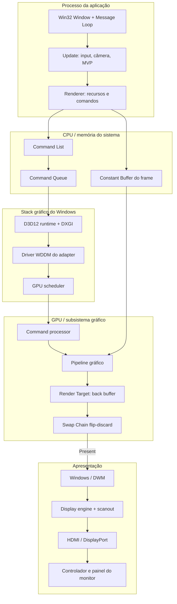
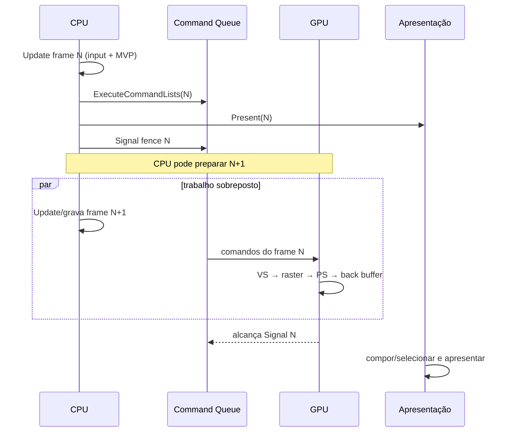
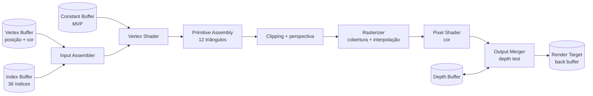
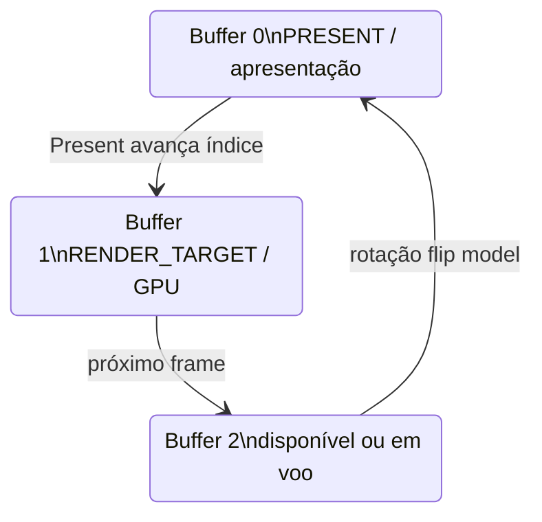
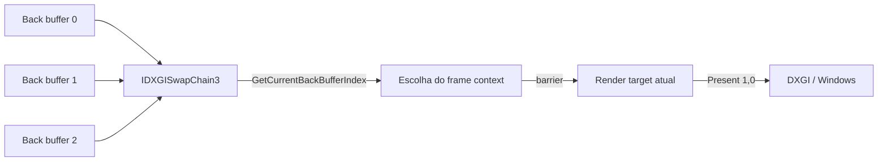
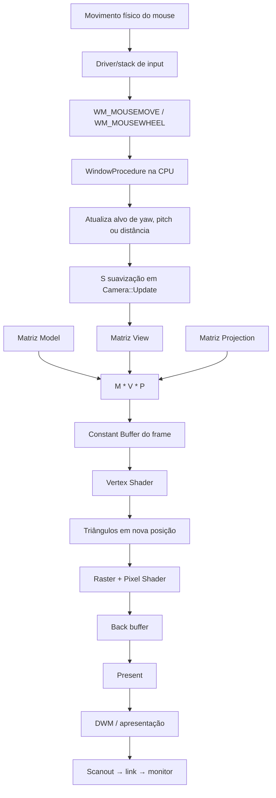
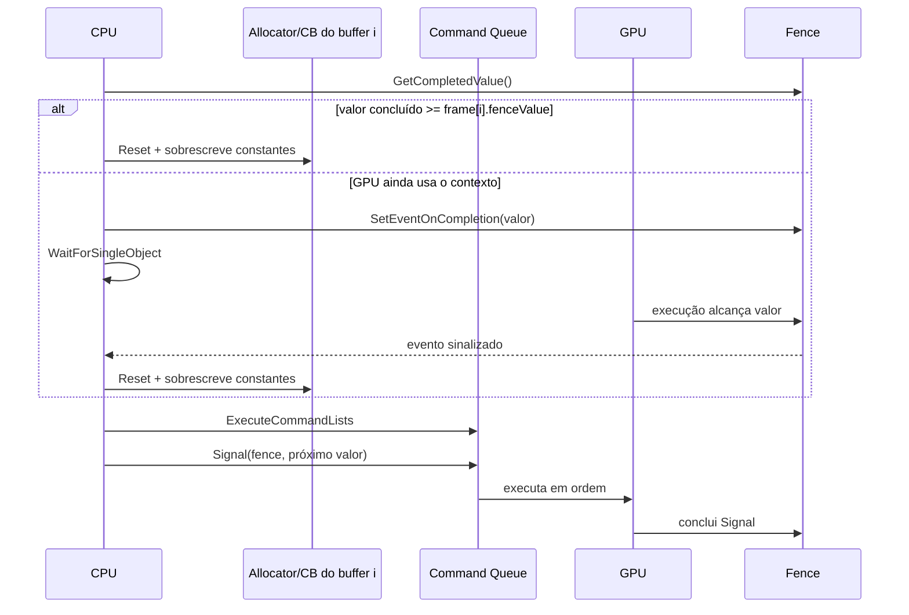
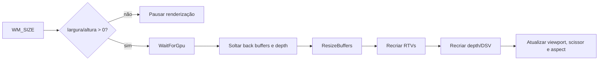

# Diagramas Mermaid

Os diagramas distinguem comandos, dados de imagem e sincronização. As setas representam relações conceituais; não afirmam cópias obrigatórias em todos os drivers/hardwares.

## 1. Arquitetura completa

## 2. Fluxo CPU/GPU sobreposto

O bloco `Present` aparece vindo da CPU porque é uma chamada da aplicação, mas o processamento da apresentação continua de forma assíncrona no sistema.

## 3. Pipeline gráfico

## 4. Swap chain tripla

## 5. Mouse até o novo frame

## 6. Sincronização com Fence

## 7. Resize (diagrama extra)

