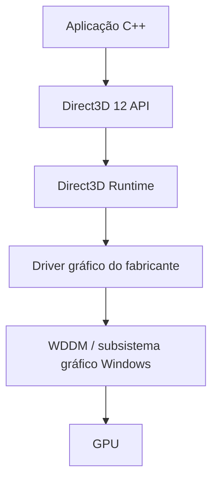

# DirectX em profundidade

Este texto usa o projeto como estudo de caso. O objetivo não é decorar siglas, mas entender quais contratos permitem que C++ descreva trabalho gráfico para hardwares diferentes e como o resultado chega ao monitor.

## O que é DirectX?

DirectX não é simplesmente “um programa” nem sinônimo de placa de vídeo. É uma família/ecossistema de APIs, interfaces, runtimes e tecnologias do Windows para gráficos, áudio, entrada e multimídia. Partes diferentes resolvem problemas diferentes e evoluíram em ritmos próprios.

Quando o projeto inclui `d3d12.h`, cria interfaces COM e vincula `d3d12.lib`, ele usa **Direct3D 12**, a API gráfica 3D/compute de baixo nível da família DirectX. Quando enumera adapters ou apresenta back buffers, usa **DXGI**.

## O que significa API?

API significa *Application Programming Interface*: uma interface de programação de aplicações. É um contrato que define nomes, tipos, parâmetros, resultados e regras observáveis. A aplicação sabe como pedir uma operação; não precisa conhecer todas as instruções privadas de cada GPU.

Exemplos reais deste projeto:

- `D3D12CreateDevice`: solicita uma interface lógica D3D12 para um adapter e capacidade mínima;
- `CreateCommandQueue`: cria a fila que receberá listas de comandos;
- `CreateCommittedResource`: cria buffers/texturas e associa armazenamento;
- `ExecuteCommandLists`: submete listas fechadas à queue;
- `Present`: solicita que um back buffer entre no caminho de apresentação.

O contrato não significa que a chamada execute tudo imediatamente. `ExecuteCommandLists`, por exemplo, enfileira trabalho assíncrono. `Present` não significa “o pixel já acendeu no monitor” quando retorna.

## DirectX vs Direct3D

**DirectX** é a família/ecossistema. **Direct3D** é o componente/API para gráficos 3D e compute na GPU. Dizer “este projeto usa DirectX 12” é comum, mas a formulação tecnicamente precisa é: ele usa a API Direct3D 12, além de DXGI e HLSL, dentro do ecossistema DirectX/Windows.

## APIs relacionadas

| Componente | Papel típico |
|---|---|
| Direct3D | pipeline 3D, compute, recursos e comandos para GPU |
| DXGI | adapters, outputs, formatos, swap chains e apresentação |
| Direct2D | desenho 2D acelerado e primitivas vetoriais |
| DirectWrite | layout, rasterização e renderização de texto |
| XAudio2 | engine/API de áudio de baixo nível |

Esses nomes não descrevem um executável monolítico. São APIs/componentes relacionados, com runtimes, DLLs, drivers e integração no sistema operacional. Este projeto usa Dear ImGui para UI, mas seu backend traduz a interface em comandos Direct3D 12; não substitui o renderer da cena.

## DXGI

DirectX Graphics Infrastructure fica na fronteira entre aplicação, adapters e apresentação:

- **adapter:** implementação gráfica enumerável, normalmente GPU + driver ou WARP;
- **output:** saída de exibição associada ao subsistema gráfico;
- **formatos:** descrições como `DXGI_FORMAT_R8G8B8A8_UNORM`;
- **swap chain:** conjunto de back buffers associado à janela;
- **Present:** operação que entrega um buffer ao sistema de apresentação.

DXGI não cria a câmera nem ilumina o objeto. Ele fornece infraestrutura para selecionar recursos do sistema e apresentar imagens produzidas.

## HLSL

HLSL (*High-Level Shader Language*) é uma linguagem semelhante a C para estágios programáveis da GPU. O fonte é compilado para bytecode compatível com um perfil, por exemplo `vs_5_1`, `hs_5_1`, `ds_5_1` ou `ps_5_1`.

Neste projeto:

- Cube VS transforma vértices e encaminha posição de mundo/normal;
- Surface VS encaminha control points;
- Hull Shader define fatores de tessellation;
- o tessellator fixed-function gera domínios `(u,v)`;
- Domain Shader avalia a superfície Bézier e suas derivadas;
- Pixel Shader calcula ambient + diffuse + specular.

O HLSL pode ser compilado antecipadamente ou durante a inicialização. Aqui `D3DCompileFromFile` compila no início para deixar arquivos e erros didaticamente visíveis; não há compilação a cada frame.

## O que é ID3D12Device?

`ID3D12Device` **não é fisicamente a GPU**. É uma interface COM lógica associada ao adapter escolhido. A aplicação a usa para criar Command Queues, recursos, descriptor heaps, Root Signatures, PSOs e fences.

Uma analogia limitada: o adapter identifica a implementação/capacidade; o Device é a “porta contratual” usada para fabricar objetos válidos naquela implementação. Destruir a interface não desmonta o hardware, e duas aplicações podem ter Devices relacionados à mesma GPU.

## O que é um driver?

O driver gráfico da NVIDIA, AMD, Intel ou outro fornecedor implementa a ligação entre o modelo padronizado do Windows/Direct3D e o hardware específico. Ele participa de tarefas como validação/tradução de comandos, compilação final adequada à arquitetura, gerenciamento com o sistema e exposição de capacidades.

É por isso que aplicações podem usar interfaces D3D12 semelhantes em GPUs internamente muito diferentes: a API define comportamento e estruturas comuns; runtime, driver e hardware implementam esse contrato. Isso não torna todas as GPUs equivalentes em recursos ou desempenho.



O desenho é uma simplificação didática. Runtime, driver, scheduler WDDM, filas e firmware podem interagir de formas sobrepostas; não são necessariamente cinco chamadas síncronas em série.

## DirectX depende de software ou hardware?

Depende de três camadas cooperando:

1. **Windows/runtime:** oferece APIs, DXGI, carregamento, validação e integração com o sistema;
2. **driver:** implementa o contrato para o adapter e expõe capacidades;
3. **GPU/hardware:** executa comandos, shaders, rasterização, memória e apresentação.

Também existe WARP, implementação por software. Portanto, Direct3D é uma API de software capaz de dirigir hardware, mas não é apenas software isolado nem apenas uma característica da GPU.

## Atualização do DirectX

No Windows moderno, componentes centrais do runtime gráfico fazem parte do sistema operacional e normalmente são atualizados pelo Windows/Windows Update. O driver gráfico é atualizado separadamente pelo Windows ou fornecedor. Ferramentas e compiladores, como Windows SDK/DXC, têm seus próprios pacotes.

Atualizar runtime ou driver pode corrigir bugs, habilitar caminhos já suportados ou expor extensões previstas. **Não adiciona unidades físicas ou capacidade que o silício não possui.** Uma GPU sem determinado recurso obrigatório não passa a tê-lo apenas por instalar software mais novo; quando possível, o driver/runtime pode emular algo, com limitações/custo.

## Feature Levels: API não é capacidade mínima

Existem numerações independentes:

| Sistema de versão | Exemplo | O que descreve |
|---|---|---|
| versão da API | Direct3D 12 | modelo de programação e interfaces usadas |
| Feature Level | `D3D_FEATURE_LEVEL_11_0` | conjunto mínimo de capacidades exigidas |
| Shader Model | 5.1 | linguagem/perfis e recursos programáveis dos shaders |

O projeto chama:

```cpp
D3D12CreateDevice(adapter, D3D_FEATURE_LEVEL_11_0, ...);
```

Isso **não significa Direct3D 11**. Significa:

- API usada: Direct3D 12;
- capacidade mínima aceita do driver/hardware: Feature Level 11_0.

A API D3D12 vai até FL 11_0 como mínimo. Tessellation com Hull/Domain Shader pertence ao conjunto necessário nesse nível, por isso a superfície funciona sem exigir FL 12_0. Feature level é capacidade funcional mínima, não medida de velocidade.

## Shader Model

Shader Model tem numeração separada. Este projeto compila perfis Shader Model 5.1 (`vs_5_1`, `hs_5_1`, `ds_5_1`, `ps_5_1`) usando o compilador HLSL do Windows SDK. Direct3D 12 também pode usar famílias Shader Model 6 com DXC/DXIL, mas isso não é obrigatório para demonstrar o pipeline escolhido.

Não conclua que “Shader Model 5.1 = DirectX 11.5” ou que “Feature Level 11_0 = Shader Model 11”. São eixos diferentes.

## Capacidades e CheckFeatureSupport

Feature Level estabelece uma base. Muitos recursos têm tiers/opções independentes. `ID3D12Device::CheckFeatureSupport` consulta estruturas como:

- opções gerais do D3D12;
- feature levels suportados;
- Shader Model;
- suporte de formato;
- níveis de qualidade de multisampling;
- tiers de recursos específicos.

Uma aplicação que depende de algo opcional deve consultar e escolher fallback ou abortar com mensagem clara. Este projeto usa recursos garantidos pela base solicitada e tenta WARP se nenhum adapter de hardware puder criar o Device.

## GPU em nível conceitual

Sem assumir microarquitetura de fabricante, uma GPU pode ser entendida por funções:

- **command processor/front-end:** consome comandos das filas;
- **execution units/shader cores:** executam muitas invocações de shader;
- **unidades de rasterização/funções fixas:** transformam primitivas em cobertura/amostras;
- **hierarquia de memória:** registradores, caches e memória usada por recursos;
- **display engine:** lê a superfície apresentada e produz scanout para a saída.

“Milhares de operações paralelas” é uma intuição útil, mas detalhes de wave size, scheduling, caches e unidades mudam entre arquiteturas.

## Software renderer: WARP

WARP (*Windows Advanced Rasterization Platform*) é um rasterizador Direct3D por software. Ele executa trabalho gráfico na CPU usando o mesmo tipo de interface da API, útil para compatibilidade, testes e máquinas sem GPU adequada.

| Hardware adapter | WARP |
|---|---|
| comandos executados primariamente pela GPU | rasterização/shaders executados por software na CPU |
| normalmente maior desempenho 3D | desempenho inferior para esta carga |
| depende do driver do fabricante | implementação de software da Microsoft |

O renderer primeiro enumera adapter de hardware e ignora software. Se nenhum criar Device D3D12 no nível exigido, chama `EnumWarpAdapter`. O painel/título identifica `(WARP/software)` para não fingir que uma GPU física foi usada.

## Da linha de C++ até o pixel físico

```text
C++ da aplicação
↓ chamadas da API Direct3D 12 / DXGI
runtime
↓
driver + WDDM/scheduler
↓
Command Queue / command processor da GPU
↓
pipeline: IA → VS → [HS → tessellator → DS] → rasterizer → PS → OM
↓
Render Target / back buffer
↓ Present
Swap Chain / Windows / DWM
↓
display engine / scanout
↓
HDMI ou DisplayPort (caminhos típicos)
↓
controlador e painel do monitor
```

Colchetes indicam os estágios usados somente pela superfície. O cubo segue de VS para montagem/rasterização. O ImGui gera outros draws de triângulos depois da cena, no mesmo render target.

O monitor recebe um sinal de exibição mais tarde; a CPU não percorre um cabo “mandando pixels” a cada chamada de desenho. Veja `COMO_UMA_IMAGEM_CHEGA_AO_MONITOR.md` para composição, flip model e scanout.

## O que o Direct3D não faz sozinho

Direct3D não cria automaticamente:

- objetos 3D conceituais;
- câmera ou matrizes Model/View/Projection;
- luzes, material ou equação Blinn-Phong;
- pontos de controle e fórmula Bézier;
- física, colisão ou lógica da aplicação;
- escolha artística de cores e aparência.

Ele oferece mecanismos para buffers, shaders, pipeline, recursos, comandos, sincronização e apresentação. A aplicação define os dados e algoritmos. Neste projeto, “cubo”, “câmera”, “luz” e “superfície” são decisões do nosso código sobre mecanismos D3D12.

## Por que Direct3D 12 é considerado baixo nível?

Uma engine como Unity ou Unreal fornece cenas, componentes, importadores, materiais, editores e pipelines prontos. Direct3D 12 expõe mecanismos mais próximos do trabalho do sistema gráfico. A aplicação gerencia explicitamente:

- resource states e Resource Barriers;
- Command Lists, Allocators e Queues;
- descriptor heaps e views;
- Root Signature e PSOs;
- recursos/memória e layouts;
- fences e reutilização segura por frame;
- swap chain e resize.

“Baixo nível” é relativo: D3D12 ainda é uma API abstrata e não programação direta dos transistores. OpenGL tradicional costuma esconder mais estado/sincronização; D3D12/Vulkan expõem mais controle. Engines ficam em nível mais alto e podem internamente usar essas APIs.

## Relação com esta demonstração

O painel não transforma o programa numa engine. Cada checkbox altera dados simples na CPU; a constant buffer leva flags/parâmetros à GPU. Trocar Cube/Bezier seleciona PSO, topology e draw call. Wireframe troca PSO. Tessellation altera o fator do Hull Shader. Luz/material alteram a equação do Pixel Shader. O caminho Command List → Queue → GPU → back buffer → Present permanece explícito.

## Referências oficiais

- [Hardware Feature Levels](https://learn.microsoft.com/windows/win32/direct3d12/hardware-feature-levels)
- [D3D12_FEATURE e consultas](https://learn.microsoft.com/windows/win32/api/d3d12/ne-d3d12-d3d12_feature)
- [Guia de programação HLSL](https://learn.microsoft.com/windows/win32/direct3dhlsl/dx-graphics-hlsl-pguide)
- [WARP Guide](https://learn.microsoft.com/windows/win32/direct3darticles/directx-warp)
- [Work submission in Direct3D 12](https://learn.microsoft.com/windows/win32/direct3d12/command-queues-and-command-lists)
